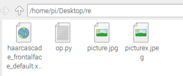
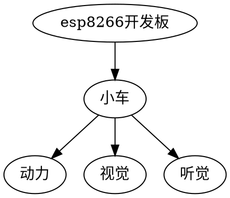
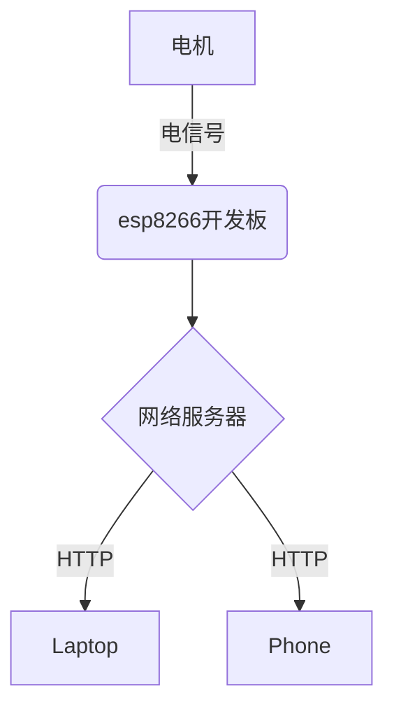

# 人工智能课程文档

 <font size=5>目录</font>

<!-- @import "[TOC]" {cmd="toc" depthFrom=1 depthTo=6 orderedList=false} -->

<!-- code_chunk_output -->

- [人工智能课程文档](#人工智能课程文档)
  - [**课程概述**](#课程概述)
    - [课程简介](#课程简介)
    - [课程目标](#课程目标)
    - [课程大纲](#课程大纲)
    - [预备要求](#预备要求)
    - [学分授予](#学分授予)
    - [参考资源](#参考资源)
  - [**前导**](#前导)
    - [计算机概述](#计算机概述)
        - [计算机的发展](#计算机的发展)
        - [计算机的操作系统](#计算机的操作系统)
        - [计算机语言与程序设计](#计算机语言与程序设计)
    - [人工智能概述](#人工智能概述)
        - [人工智能的发展](#人工智能的发展)
        - [人工智能的关键技术](#人工智能的关键技术)
          - [云计算与大数据](#云计算与大数据)
          - [知识图谱](#知识图谱)
          - [机器学习](#机器学习)
          - [自然语言处理](#自然语言处理)
          - [计算机视觉](#计算机视觉)
          - [智能机器人](#智能机器人)
          - [类脑智能](#类脑智能)
        - [人工智能的应用](#人工智能的应用)
          - [人工智能在金融领域的应用](#人工智能在金融领域的应用)
          - [人工智能在医疗领域的应用](#人工智能在医疗领域的应用)
          - [人工智能在家居领域的应用](#人工智能在家居领域的应用)
          - [人工智能在汽车领域的应用](#人工智能在汽车领域的应用)
          - [人工智能在零售领域的应用](#人工智能在零售领域的应用)
          - [人工智能在教育领域的应用](#人工智能在教育领域的应用)
    - [物联网概述](#物联网概述)
        - [物联网的发展](#物联网的发展)
        - [物联网的关键技术](#物联网的关键技术)
          - [边缘计算](#边缘计算)
        - [物联网的应用](#物联网的应用)
          - [物联网在家居领域的应用](#物联网在家居领域的应用)
          - [物联网在教育领域的应用](#物联网在教育领域的应用)
    - [开源硬件概述](#开源硬件概述)
        - [开源硬件的发展](#开源硬件的发展)
        - [流行的开源硬件](#流行的开源硬件)
          - [NVIDIA Jetson Nano](#nvidia-jetson-nano)
          - [树莓派](#树莓派)
          - [Arduino](#arduino)
          - [ESPRESSIF](#espressif)
          - [传感器](#传感器)
  - [**环境准备**](#环境准备)
  - [在笔记本电脑上的操作](#在笔记本电脑上的操作)
    - [Anaconda](#anaconda)
      - [基本命令概览](#基本命令概览)
        - [创建环境](#创建环境)
        - [进入环境](#进入环境)
        - [安装指定包](#安装指定包)
        - [其他命令](#其他命令)
      - [setup](#setup)
    - [VSCode](#vscode)
      - [setup](#setup-1)
    - [CP2102驱动](#cp2102驱动)
    - [Arduino IDE](#arduino-ide)
      - [setup](#setup-2)
  - [在Jetson Nano上的操作](#在jetson-nano上的操作)
  - [在树莓派上的操作](#在树莓派上的操作)
  - [下载课程文件](#下载课程文件)
      - [Windows](#windows)
      - [macOS、Debian和Ubuntu](#macos-debian和ubuntu)
  - [其他](#其他)
  - [**第1章 人工智能体验**](#第1章-人工智能体验)
    - [第1节 人工智能的数学基础](#第1节-人工智能的数学基础)
    - [第2节 趣味概率论与信息论](#第2节-趣味概率论与信息论)
    - [第3节 Python计算机视觉编程](#第3节-python计算机视觉编程)
      - [3.1 基于opencv的人脸识别操作](#31-基于opencv的人脸识别操作)
        - [**硬件准备**](#硬件准备)
        - [**环境准备**](#环境准备-1)
        - [**程序及操作**](#程序及操作)
    - [第4节 前馈神经网络（BPN）应用](#第4节-前馈神经网络bpn应用)
      - [4.1 MNIST手写数字识别](#41-mnist手写数字识别)
    - [第5节 卷积神经网络（CNN）应用](#第5节-卷积神经网络cnn应用)
      - [5.1 Tensorflow训练自定义图片分类器](#51-tensorflow训练自定义图片分类器)
        - [**硬件准备**](#硬件准备-1)
        - [**程序及操作**](#程序及操作-1)
      - [5.2 图像风格迁移](#52-图像风格迁移)
        - [**环境准备**](#环境准备-2)
          - [VGG 网络](#vgg-网络)
          - [软件准备](#软件准备)
        - [**程序及操作**](#程序及操作-2)
    - [第6节 深度神经网络（RNN）应用](#第6节-深度神经网络rnn应用)
      - [6.1 使用循环神经网络（RNN）来生成古诗词](#61-使用循环神经网络rnn来生成古诗词)
        - [**硬件准备**](#硬件准备-2)
        - [**程序及操作**](#程序及操作-3)
    - [第7节 人工智能与游戏](#第7节-人工智能与游戏)
      - [7.1 使用强化学习算法（DQN）训练游戏AI](#71-使用强化学习算法dqn训练游戏ai)
        - [**硬件准备**](#硬件准备-3)
        - [**程序及操作**](#程序及操作-4)
      - [7.2 使用进化算法来训练马里奥](#72-使用进化算法来训练马里奥)
        - [**硬件准备**](#硬件准备-4)
        - [**程序及操作**](#程序及操作-5)
  - [**第2章 家庭智能改造大作战**（网龙VR编辑器）](#第2章-家庭智能改造大作战网龙vr编辑器)
    - [第1节 智慧的家，应该是什么样子呢](#第1节-智慧的家应该是什么样子呢)
    - [第2节 智慧客厅](#第2节-智慧客厅)
    - [第3节 智慧厨房](#第3节-智慧厨房)
    - [第4节 智慧安防](#第4节-智慧安防)
    - [第5节 智慧校园和智慧教室](#第5节-智慧校园和智慧教室)
  - [**第3章 智能车“小白”**](#第3章-智能车小白)
    - [第1节 认识小白的心脏：esp8266开发板的初步使用](#第1节-认识小白的心脏esp8266开发板的初步使用)
      - [**学习流程**](#学习流程)
        - [课程引入（10分钟）](#课程引入10分钟)
        - [基本任务（30分钟）](#基本任务30分钟)
        - [活动小结（5分钟）](#活动小结5分钟)
      - [**活动目标**](#活动目标)
      - [**背景知识**](#背景知识)
        - [物联网背景知识](#物联网背景知识)
        - [使用开发板读取传感器数据](#使用开发板读取传感器数据)
      - [**硬件准备**](#硬件准备-5)
        - [硬件清单](#硬件清单)
        - [硬件连接](#硬件连接)
      - [**程序及操作**](#程序及操作-6)
        - [简单读取](#简单读取)
        - [绘制实时曲线](#绘制实时曲线)
        - [相关代码](#相关代码)
      - [**活动小结**](#活动小结)
    - [第2节 一个小白的诞生](#第2节-一个小白的诞生)
      - [**学习流程**](#学习流程-1)
        - [课程引入（10分钟）](#课程引入10分钟-1)
        - [基本任务（30分钟）](#基本任务30分钟-1)
        - [活动小结（5分钟）](#活动小结5分钟-1)
      - [**活动目标**](#活动目标-1)
      - [**背景知识**](#背景知识-1)
        - [HTTP通信](#http通信)
        - [**电机**](#电机)
      - [**硬件准备**](#硬件准备-6)
        - [整体结构](#整体结构)
        - [硬件清单](#硬件清单-1)
        - [硬件连接](#硬件连接-1)
      - [**程序及操作**](#程序及操作-7)
        - [操作步骤](#操作步骤)
        - [相关代码](#相关代码-1)
      - [**活动小结**](#活动小结-1)
    - [第3节 是汽车也是汽车人：小白的机械臂](#第3节-是汽车也是汽车人小白的机械臂)
      - [**学习流程**](#学习流程-2)
        - [课程引入（15分钟）](#课程引入15分钟)
        - [基本任务（35分钟）](#基本任务35分钟)
        - [活动小结（10分钟）](#活动小结10分钟)
      - [**活动目标**](#活动目标-2)
      - [**背景知识**](#背景知识-2)
        - [舵机](#舵机)
        - [舵机的工作原理](#舵机的工作原理)
        - [脉冲宽度调制（PWM）](#脉冲宽度调制pwm)
        - [占空比](#占空比)
      - [**硬件准备**](#硬件准备-7)
        - [硬件清单](#硬件清单-2)
        - [硬件连接](#硬件连接-2)
      - [**程序及操作**](#程序及操作-8)
        - [操作步骤](#操作步骤-1)
        - [相关代码](#相关代码-2)
      - [**活动小结**](#活动小结-2)
    - [第4节 视物而行：为小白增加视觉系统](#第4节-视物而行为小白增加视觉系统)
      - [**学习流程**](#学习流程-3)
        - [课程引入（10分钟）](#课程引入10分钟-2)
        - [基本任务（30分钟）](#基本任务30分钟-2)
        - [活动小结（5分钟）](#活动小结5分钟-2)
      - [**活动目标**](#活动目标-3)
      - [**背景知识**](#背景知识-3)
      - [**硬件准备**](#硬件准备-8)
        - [硬件清单](#硬件清单-3)
        - [硬件连接](#硬件连接-3)
      - [**程序及操作**](#程序及操作-9)
        - [操作步骤](#操作步骤-2)
        - [代码详解](#代码详解)
      - [**活动小结**](#活动小结-3)
    - [第5节 听声辨位：小白会自动避障了](#第5节-听声辨位小白会自动避障了)
      - [**学习流程**](#学习流程-4)
        - [课程引入（10分钟）](#课程引入10分钟-3)
        - [基本任务（30分钟）](#基本任务30分钟-3)
        - [活动小结（5分钟）](#活动小结5分钟-3)
      - [**活动目标**](#活动目标-4)
      - [**背景知识**](#背景知识-4)
        - [**超声传感器**](#超声传感器)
        - [**超声波测距原理**](#超声波测距原理)
      - [**硬件准备**](#硬件准备-9)
        - [硬件清单](#硬件清单-4)
        - [硬件连接](#硬件连接-4)
      - [**程序及操作**](#程序及操作-10)
        - [操作步骤](#操作步骤-3)
        - [相关代码](#相关代码-3)
      - [**活动小结**](#活动小结-4)
    - [第6节 综合与进阶](#第6节-综合与进阶)
      - [**趣味比赛**](#趣味比赛)
        - [比赛规则](#比赛规则)
      - [**功能参考**](#功能参考)
    - [尾声](#尾声)
  - [**第3章 自动追踪小车“大白”**](#第3章-自动追踪小车大白)
    - [第1节 环境准备：更加专业的视觉系统](#第1节-环境准备更加专业的视觉系统)
      - [**硬件准备**](#硬件准备-10)
      - [**程序及操作**](#程序及操作-11)
    - [第2节 大白变身存钱罐车——仅限投食1元硬币](#第2节-大白变身存钱罐车仅限投食1元硬币)
    - [第3节 大白喜欢你还是乒乓球：训练分类器](#第3节-大白喜欢你还是乒乓球训练分类器)
  - [**第4章 无人驾驶小车“老白”**](#第4章-无人驾驶小车老白)
    - [第1节 环境准备：更加更加专业的视觉系统，甚至有一点人工智能](#第1节-环境准备更加更加专业的视觉系统甚至有一点人工智能)
      - [**硬件准备**](#硬件准备-11)
        - [硬件清单](#硬件清单-5)
        - [硬件连接](#硬件连接-5)
      - [**程序及操作**](#程序及操作-12)
        - [操作步骤](#操作步骤-4)
      - [电机和摄像头驱动测试](#电机和摄像头驱动测试)
        - [操作步骤-电机测试](#操作步骤-电机测试)
        - [操作步骤-摄像头测试](#操作步骤-摄像头测试)
    - [第2节 无人驾驶数据采集及训练](#第2节-无人驾驶数据采集及训练)
      - [**硬件准备**](#硬件准备-12)
        - [硬件清单](#硬件清单-6)
        - [硬件搭建-跑道](#硬件搭建-跑道)
      - [**程序及操作**](#程序及操作-13)
        - [操作步骤-驾驶数据采集](#操作步骤-驾驶数据采集)
        - [操作步骤-驾驶数据训练](#操作步骤-驾驶数据训练)
    - [第3节 开始无人驾驶](#第3节-开始无人驾驶)
      - [**程序及操作**](#程序及操作-14)
        - [操作步骤](#操作步骤-5)
  - [**第5章 机器人“小绿”**](#第5章-机器人小绿)
    - [第1节 环境准备：Home Assistant安装和配置](#第1节-环境准备home-assistant安装和配置)
      - [**硬件准备**](#硬件准备-13)
        - [硬件清单](#硬件清单-7)
        - [硬件连接](#硬件连接-6)
      - [**程序及操作**](#程序及操作-15)
        - [安装过程](#安装过程)
    - [第2节 小绿出生了：组装小绿](#第2节-小绿出生了组装小绿)
      - [**硬件准备**](#硬件准备-14)
      - [**程序及操作**](#程序及操作-16)
    - [第3节 小绿的一小步，我们的一大步](#第3节-小绿的一小步我们的一大步)
    - [第4节 小绿会说话了：训练语音识别，开始和小绿聊天](#第4节-小绿会说话了训练语音识别开始和小绿聊天)
      - [**硬件准备**](#硬件准备-15)
      - [**程序及操作**](#程序及操作-17)
    - [第5节 小绿的魔法：可以控制灯泡了](#第5节-小绿的魔法可以控制灯泡了)
      - [**硬件准备**](#硬件准备-16)
      - [**程序及操作**](#程序及操作-18)
    - [第6节 小绿学会了人脸解锁](#第6节-小绿学会了人脸解锁)
      - [**硬件准备**](#硬件准备-17)
      - [**程序及操作**](#程序及操作-19)
    - [第7节 使用Google Blockly积木来控制小绿](#第7节-使用google-blockly积木来控制小绿)
      - [**硬件准备**](#硬件准备-18)
      - [**程序及操作**](#程序及操作-20)
    - [第8节 唱、跳 & rap：OpenPose姿态模仿](#第8节-唱-跳-rapopenpose姿态模仿)
      - [**硬件准备**](#硬件准备-19)
      - [**程序及操作**](#程序及操作-21)

<!-- /code_chunk_output -->

---

## **课程概述**

本课程是的概述

### 课程简介

使用开源硬件体验和学习人工智能的体验和探究项目。

### 课程目标

- 了解计算机基本知识
- 了解人工智能基本概念
- ……

### 课程大纲

### 预备要求

掌握计算机基本操作。

### 学分授予

本课程根据学生学习的总评成绩发放学习证书并认定学分，总评成绩超过60分给予课程学分，此外总评成绩在60-84分发放合格证书，总评成绩大于84分发放优秀证书。总评成绩的计算公式如下：

$$ 总评成绩=平时*30\%+出勤率*20\%+期末考试成绩*50\% $$

其中：
**平时成绩**：每个章节测试成绩满分为100分，7个章节总成绩取平均值作为平时成绩，按照比例计入总分；
**出勤率**：按照出勤情况给予打分，全勤则为满分，按照比例计入总分；
**期末考试成绩**：满分100分，考试试题为实践操作，教师当场打分，按照比例计入总分。

### 参考资源

---

## **前导**

    本章内容旨在了解相关概念

### 计算机概述

##### 计算机的发展

##### 计算机的操作系统

##### 计算机语言与程序设计

### 人工智能概述

##### 人工智能的发展

##### 人工智能的关键技术

###### 云计算与大数据

###### 知识图谱

###### 机器学习

###### 自然语言处理

###### 计算机视觉

###### 智能机器人

###### 类脑智能

##### 人工智能的应用

###### 人工智能在金融领域的应用

###### 人工智能在医疗领域的应用

###### 人工智能在家居领域的应用

###### 人工智能在汽车领域的应用

###### 人工智能在零售领域的应用

###### 人工智能在教育领域的应用

### 物联网概述

##### 物联网的发展

##### 物联网的关键技术

###### 边缘计算

##### 物联网的应用

###### 物联网在家居领域的应用

###### 物联网在教育领域的应用

### 开源硬件概述

##### 开源硬件的发展

##### 流行的开源硬件

###### NVIDIA Jetson Nano

###### 树莓派

###### Arduino

###### ESPRESSIF

esp8266是一个价格低廉的开发板，包含WiFi模块和GPIO，可以连接传感器、舵机、马达等各种设备。使用Arduino IDE进行开发编程。可通过网络、串口和蓝牙等多种方式进行通信

###### 传感器

---

## **环境准备**

## 在笔记本电脑上的操作

相关软件及资源，**请[点击这里](ftp://home.hass.live)来下载**  
所需的用户名和密码均为`sli`  
也可以选择在下方提供的官方网址下载  
推荐按顺序依次安装以下软件，以避免因依赖问题报错

### Anaconda

Anaconda是一个Python环境管理软件。在Windows，Mac、Linux上均可以方便安装  
下载链接：<https://www.anaconda.com/distribution>


选择适合自己的操作系统，并选择Python 3.7版本

#### 基本命令概览

##### 创建环境

```bash {.line-numbers}
conda create -n 环境名字
//例如：  
conda create -n py27 python=2.7
//表示创建一个名字为py27，运行python2.7的虚拟环境
//后面的python=2.7是可选输入
//不输入时默认环境是python3
```

##### 进入环境

```bash {.line-numbers}
conda activate 环境名字
//例如：  
conda activate py27
```

##### 安装指定包  

```bash {.line-numbers}
conda install 包名  
//例如：安装OpenCV
conda install opencv
```

##### 其他命令

```bash {.line-numbers}
//退出环境
conda deactivate  
//列出环境
conda-env list
//删除环境
conda-env remove -n 环境名字
```

#### setup

1.下载安装Anaconda  
2.macOS用户打开`终端`, Windows用户在开始菜单打开`Anaconda Prompt`  
3.创建并进入环境 (python版本为默认的3.x)  
4.在新环境中安装TensorFlow和OpenCV（若电脑有独立显卡应安装GPU版本的TensorFlow）

```bash {.line-numbers}
//创建一个名字为myenv的虚拟环境
conda create -n myenv

//激活myenv虚拟环境
conda activate myenv

//无独立显卡的电脑使用这条命令
conda install tensorflow
//有独立显卡的电脑使用这条命令
conda install tensorflow-gpu

//安装opencv
conda install opencv

//安装git命令
conda install git
```

### VSCode

VSCode是微软出品的免费代码编辑软件。在Windows、Mac、Linux上均可以方便安装  
下载链接：<https://code.visualstudio.com>

#### setup

1.下载安装VSCode  
2.安装插件`Settings Sync`


3.输入`Shift`+`Alt`+`D`,输入GitHub Token和Gist Token([点击获取](http://hass.live:8999/))，即可从服务端同步设置。免去自己配置的麻烦

### CP2102驱动

这个驱动用于使用USB串口连接esp8266  
注意选择对应的操作系统和版本进行下载和安装  
下载链接: <https://www.silabs.com/products/development-tools/software/usb-to-uart-bridge-vcp-drivers>

### Arduino IDE

Arduino IDE （Integrated Development Environment,集成开发环境）是针对Arduino控制板的编程和下载平台。在Windows，Mac、Linux上均可以方便安装，Arduino项目文件的后缀是`*.ino`  
项目文件应在与项目名相同的文件夹中  
下载链接：<https://www.arduino.cc/en/Main/Software>

#### setup

1.下载安装Arduino IDE  
2.在`文件`--`首选项`--`附加开发板管理器网址`一栏中输入<https://arduino.esp8266.com/stable/package_esp8266com_index.json,https://dl.espressif.com/dl/package_esp32_index.json> 重启IDE


3.在`工具`--`开发板`--`开发板管理器`中分别搜索esp8266和esp32,点击对应项进行安装  


4.在`工具`--`管理库`中搜索DHT,选择DHT sensor library by Adafruit


5.在`工具`--`管理库`中搜索adafruit,选择Adafruit Unifled Sensor by Adafruit


6.打开链接<https://github.com/esp8266/arduino-esp8266fs-plugin/releases/tag/0.4.0>,选择.zip文件下载，将解压后的文件夹复制到`Arduino安装目录/tools`文件夹，然后重启IDE


默认的路径应该是这样：`C:\Program Files (x86)\Arduino\tools\esp8266FS\tool\esp8266fs.jar`
如果安装成功，会在`工具`菜单下看到下图选项:

<center></center>

7.设置开发板和端口
<center></center>

## 在Jetson Nano上的操作

## 在树莓派上的操作

## 下载课程文件  

#### Windows

- 打开`Anaconda Prompt`
- 执行`git clone https://github.com/nijisakai/learn-ai.git C:/learn-ai`  
- 文件将被下载到C盘根目录下面的learn-ai文件夹

#### macOS、Debian和Ubuntu

- 打开`终端`
- 执行`git clone https://github.com/nijisakai/learn-ai.git ~/Desktop/learn-ai/`  
- 文件将被下载到桌面下面的learn-ai文件夹

## 其他

路由器设置SSID名字为**AI**，密码为**raspberry**  
路由器管理地址设置为<http://192.168.123.1>，登录账号：admin，登录密码：admin

---

## **第1章 人工智能体验**

    本章介绍

### 第1节 人工智能的数学基础

### 第2节 趣味概率论与信息论

### 第3节 Python计算机视觉编程

#### 3.1 基于opencv的人脸识别操作

    在树莓派上利用opencv进行相关操作，实现对给定图片中相关人脸的识别功能

##### **硬件准备**

- 树莓派、电源连接线、鼠标、键盘、以及显示屏

##### **环境准备**

1.首先我们需要安装python3
在这一步里我们需要登陆python官网

> <https://www.python.org/downloads/source/>

并下载合适的python版本
2.将树莓派开机并在命令行中输入如下操作

>sudo apt-get install libcv-dev
sudo apt-get install python-opencv

这一步我们是完成opencv在树莓派上的安装，在安装后我们可以通过以下操作来导入opencv
>1、打开命令行并输入

     python3  


>2、接着输入

```bash {.line-numbers}
import cv2
```


>3、之后我们可以通过以下代码来检测我们所使用的opencv版本


3.接着我们需要安装两个库 (numpy 和 matlitlib) 一个用于计算一个用于图像绘制
使用以下代码在命令行中进行安装

```bash {.line-numbers}
pip install numpy
sudo apt-get install python3-matplotlib
```

这样我们就完成了实验所需所有的环境配置

##### **程序及操作**

1.首先需要在下面的网址里下载一个 cascade file
<https://raw.githubusercontent.com/shantnu/Webcam-Face-Detect/master/haarcascade_frontalface_default.xml>

并将其另存为

*_haarcascade_frontalface_default.xml_*

2.创建一个 .py 的文件 ( 可用我们之前安装的 Python3 打开 ) 并在文件中输入以下代码

```python {.line-numbers}
# Import OpenCV library
import cv2

# Load a cascade file for detecting faces
faceCascade = cv2.CascadeClassifier("haarcascade_frontalface_default.xml");

# Load image
image = cv2.imread('picturex.jpeg')

# Convert into grayscale
gray = cv2.cvtColor(image, cv2.COLOR_BGR2GRAY)

# Look for faces in the image using the loaded cascade file
faces = faceCascade.detectMultiScale(gray, 1.2, 5)
for (x,y,w,h) in faces:
	# Create rectangle around faces
    cv2.rectangle(image,(x,y),(x+w,y+h),(255,255,0),2)

# Create the resizeable window
cv2.namedWindow('picturex', cv2.WINDOW_NORMAL)

# Display the image
cv2.imshow('picturex', image)

# Wait until we get a key
k=cv2.waitKey(0)

# If pressed key is 's'
if k == ord('s'):
    # Save the image
    cv2.imwrite('convertedimage.jpg', image)
    # Destroy all windows
    cv2.destroyAllWindows()
# If pressed key is ESC
elif k == 27:
    # Destroy all windows
cv2.destroyAllWindows()
```

**_第8/15/23行的picturex是我们需要更改的图片名字_**

3.将 cascade file、.py文件、以及我们所需要识别的图片发在同一路径下就像下图一样 ( 这保证了我们一会程序运行的确定性 )
<center>


</center>

4.运行程序
需要我们在该目录下打开命令行（可使用快捷键鼠标点击路径按F4实现）
在命令行中输入

```python {.line-numbers}
#filename.py是你保存的代码文件的名称
python3 filename.py
```

之后我们就可以看到我们所选择的的图片加载出来，并且其中的人物的脸部会用方框圈起来

### 第4节 前馈神经网络（BPN）应用

#### 4.1 MNIST手写数字识别

### 第5节 卷积神经网络（CNN）应用

#### 5.1 Tensorflow训练自定义图片分类器

    简单的项目描述

##### **硬件准备**

##### **程序及操作**

#### 5.2 图像风格迁移

<center>


</center>

在神经网络之前，图像风格迁移的程序有一个共同的思路：分析某一种风格的图像，给那一种风格建立一个数学或者统计模型，再改变要做迁移的图像让它能更好的符合建立的模型。这样做出来效果还是不错的，但一个很大的缺点：**一个程序基本只能做某一种风格或者某一个场景**。因此基于传统风格迁移研究的实际应用非常有限。
而 Neural Style 程序通过输入一张代表内容的图片和一张代表风格的图片，使用深度学习网络输出一张融合了这个风格和内容的新作品。

##### **环境准备**

###### VGG 网络

[训练好的 VGG 19 网络](http://www.vlfeat.org/matconvnet/models/imagenet-vgg-verydeep-19.mat)，下载到项目文件夹“Neural Style 图像风格迁移”的中，或在运行时使用参数 `--network` 指定其位置。

###### 软件准备

除了在本课程最开始已经在 Anaconda 的 learn-ai 环境中安装好的 `TensorFlow` 外，还需安装 `Pillow` 软件包。

1.macOS 用户打开终端，Windows用户打开 Anaconda Prompt；
2.输入下面的命令来进入 learn-ai 环境；

```bash {.line-numbers}
conda activate learn-ai
```

3.安装 `Pillow` 软件包；

```bash {.line-numbers}
conda install pillow
```

4.切换工作路径到项目文件夹；

```bash {.line-numbers}
cd 项目文件夹的路径
```

##### **程序及操作**

```bash {.line-numbers}
python neural_style.py --content <输入图片> --styles <风格图片> --output <输出文件名> -- --iterations <迭代次数>
```

我们使用 examples 文件夹中的 1-content.jpg 和 2-style1.jpg 来举例，把上面命令中：
<输入图片> 替换为 `examples/1-content.jpg`
<风格图片> 替换为 `examples/2-style1.jpg`
<输出文件名> 替换为 `examples/output.jpg`，当然也可以不叫output，使用你自己喜欢的名字；
<迭代次数> 替换为 `100`
替换后的命令为：

```bash {.line-numbers}
python neural_style.py --content examples/1-content.jpg --styles examples/2-style1.jpg --output examples/output.jpg -- --iterations 100
```

**注意：***<输入图片>* 不建议使用过大的图片，这会明显的增加机器的负担，特别是对于性能差或者没有独立显卡的机器，可能需要数个小时来生成新的图片。*<迭代次数>* 在课程中使用的是 100 次迭代，可以初步看出机器风格迁移的效果。一般来说 1000 次迭代可以获得不错的图像质量，但会花费更多的时间。

<center>


</center>

当窗口中的迭代次数变为 “100/100” 时就完成了整个图片的处理过程，打开 examples 文件夹中的图片就可以开到结果。

### 第6节 深度神经网络（RNN）应用

#### 6.1 使用循环神经网络（RNN）来生成古诗词

    简单的项目描述

##### **硬件准备**

##### **程序及操作**

@import "./chapter2/part1/古诗词/poet_rnn_output.py" {cmd='/anaconda3/envs/learn-ai/bin/python'}

### 第7节 人工智能与游戏

#### 7.1 使用强化学习算法（DQN）训练游戏AI

    简单的项目描述

##### **硬件准备**

##### **程序及操作**

#### 7.2 使用进化算法来训练马里奥

    简单的项目描述

##### **硬件准备**

##### **程序及操作**

## **第2章 家庭智能改造大作战**（网龙VR编辑器）

虚拟的网页端小实验和实际的相结合

### 第1节 智慧的家，应该是什么样子呢

    在网页端以拖拽的方式，为虚拟的家增加各种设备。

### 第2节 智慧客厅

### 第3节 智慧厨房

### 第4节 智慧安防

### 第5节 智慧校园和智慧教室

## **第3章 智能车“小白”**

  通过迭代的方式不断赋予小车更多的功能



### 第1节 认识小白的心脏：esp8266开发板的初步使用

    熟悉操作esp8266的步骤。是第一章的基础  
    包括功能提出和实现，硬件连接，上传的参数调节和html文件在本地服务器中的打开，传感器数据的实时呈现等，并使用Chart.js来绘制实时变化曲线  
    这部分主要包括两种传感器的读取，为温湿度传感器和超声波传感器
---

#### **学习流程**

##### 课程引入（10分钟）

<center>

活动名称 | 活动内容 | 时间分配
:-: | :-: | :-:
活动目标| 了解物联网基本概念 | 5分钟
背景知识 | 熟悉实验中涉及到的软硬件 | 5分钟

</center>

##### 基本任务（30分钟）

<center>

活动名称 | 活动内容 | 时间分配
:-: | :-: | :-:
硬件准备 | 将硬件按文档进行连接 | 5分钟
程序及操作 | 完成程序及操作文档部分 | 25分钟

</center>

##### 活动小结（5分钟）

---

#### **活动目标**

- 了解物联网的基本概念
- 了解使用开发板读取传感器的基本原理
- 熟悉使用Arduino IDE烧录固件的操作流程

#### **背景知识**

##### 物联网背景知识

<center><iframe src="https://player.bilibili.com/player.html?aid=46814591&cid=82000363&page=1" width="800" height="600" scrolling="no" border="0" frameborder="no" framespacing="0" allowfullscreen="true"> </iframe></center>

##### 使用开发板读取传感器数据

esp8266是WiFi串口模块，功能简单来讲就是：从WiFi接收到数据，串口输出；从串口接收数据，WiFi输出数据。  

通过自带的GPIO口连接传感器，传感器将环境数据转化为电信号发送给esp8266读取、处理并输出。

#### **硬件准备**

##### 硬件清单

- esp8266主板
插图
- 温湿度传感器（型号为DHT11或DHT22）
插图
- 超声波传感器（型号为HC-SR04）
插图
- 杜邦线、数据线
插图

##### 硬件连接

<center></center>

<center></center>
图解
#### **程序及操作**

##### 简单读取

1.打开`learn-ai`文件夹，打开路径`codes/chapter2/esp8266_projects/esp8266_dht11_http`  
2.将esp8266通过数据线连接到电脑  
3.使用Arduino IDE打开文件`esp8266_dht11_https.ino`  
4.记得把前面的[环境准备](#setup-2)部分再次确认，将环境正确配置，然后点击上传按钮进行上传  

<center></center>

5.打开[路由器管理地址](http://192.168.0.1)，esp8266此时应该已经加入到了局域网中，查看esp8266获取到的路由器地址  
6.在浏览器中打开esp8266获取到的局域网地址，查看温湿度传感器的读数  
7.连接另一个esp8266开发板，打开路径`codes/chapter2/esp8266_projects/esp8266_ultrasonic_http`,再次执行2-6步骤来使用超声波传感器  

##### 绘制实时曲线

1.打开`learn-ai`文件夹，打开路径`codes/chapter2/esp8266_projects/esp8266_dht11_http_chartjs`  
2.将esp8266通过数据线连接到电脑  
3.使用Arduino IDE打开文件 `esp8266_dht11_http_chartjs.ino`  
4.记得把前面的[环境准备](#setup-2)部分再次确认，将环境正确配置，然后点击上传按钮进行上传  

<center></center>

5.打开[路由器管理地址](http://192.168.0.1)，esp8266此时应该已经加入到了局域网中，查看esp8266获取到的路由器地址  
6.在浏览器中打开esp8266获取到的局域网地址，查看温湿度传感器的读数  

<center></center>

##### 相关代码

- 温湿度传感器

```arduino {.line-numbers} {cmd}
//两个反斜杠代表单行注释，这后面的文字不会被执行

/*
  被星号和反斜杠包围的部分可以进行多行注释
*/

/*使用多行注释符

  Arduino程序包含了两个主要的方法，分别是
  void setup()和void loop()
  方法后面写一对{},在这里面写方法的具体内容。看起来像是这样：
  void setup(){
    自己规定的语句
    自己规定的语句
    自己规定的语句
  }
  void loop(){
    自己规定的语句
    自己规定的语句
    自己规定的语句
  }
*/


//使用 #include来引用一些附加的功能。
#include <esp8266WiFi.h>
#include <esp8266WebServer.h>
#include "DHT.h"


/////////////////////////////////////////////
////////////////下面的部分请你配置//////////////
/////////////////////////////////////////////

// 1️⃣选择使用哪一种DHT传感器。通过去掉前面的注释符来使语句生效
#define DHTTYPE DHT11   // DHT 11
//#define DHTTYPE DHT21   // DHT 21 (AM2301)
//#define DHTTYPE DHT22   // DHT 22  (AM2302), AM2321

// 2️⃣把引号里的内容替换为自己路由器的用户名和密码
const char* ssid = "AI";  // 输入路由器用户名
const char* password = "raspberry";  //输入路由器密码

// 3️⃣把DHT传感器的Data接口连接到D8。此处与硬件连线对应即可
uint8_t DHTPin = D8;

// 4️⃣默认为80端口，如果改为其他端口，访问的时候在最后加上（:端口名）
esp8266WebServer server(80);

/////////////////////////////////////////////
////////////////上面的部分请你配置//////////////
/////////////////////////////////////////////

// 初始化你连接的DHT传感器
DHT dht(DHTPin, DHTTYPE);
//定义两个float变量来读取温湿度
float Temperature; //温度
float Humidity; //湿度


//开始最后的准备工作
void setup() {
  Serial.begin(115200);
  delay(100);
  
  pinMode(DHTPin, INPUT);
  dht.begin();

  Serial.println("Connecting to ");
  Serial.println(ssid);

  WiFi.begin(ssid, password);

  //检查连接是否正常
  while (WiFi.status() != WL_CONNECTED) {
  delay(1000);
  Serial.print(".");
  }
  Serial.println("");
  Serial.println("WiFi connected..!");
  Serial.print("Got IP: ");  Serial.println(WiFi.localIP());

  server.on("/", handle_OnConnect);
  server.onNotFound(handle_NotFound);

  server.begin();
  Serial.println("http server started");
}

void handle_OnConnect() {
  Temperature = dht.readTemperature();
  Humidity = dht.readHumidity();
  server.send(200, "text/html", SendHTML(Temperature,Humidity));
}

void handle_NotFound(){
  server.send(404, "text/plain", "Not found");
}

String SendHTML(float Temperaturestat,float Humiditystat){
  String ptr = "<!DOCTYPE html> <html>\n";
  ptr +="<head><meta charset=\"UTF-8\"><meta name=\"viewport\" content=\"width=device-width, initial-scale=1.0, user-scalable=no\">\n";
  ptr +="<title>esp8266 DHT11</title>\n";

  ptr +="<script>\n";
  ptr +="setInterval(loadDoc,200);\n";
  ptr +="function loadDoc() {\n";
  ptr +="var xhttps = new XMLhttpsRequest();\n";
  ptr +="xhttps.onreadystatechange = function() {\n";
  ptr +="if (this.readyState == 4 && this.status == 200) {\n";
  ptr +="document.getElementById(\"webpage\").innerHTML =this.responseText}\n";
  ptr +="};\n";
  ptr +="xhttps.open(\"GET\", \"/\", true);\n";
  ptr +="xhttps.send();\n";
  ptr +="}\n";
  ptr +="</script>\n";
  ptr +="</head>\n";
  ptr +="<body>\n";
  ptr +="<div id=\"webpage\">\n";

  ptr +="<p>温度: ";
  ptr +=(int)Temperaturestat;
  ptr +="°C</p>";
  ptr +="<p>湿度: ";
  ptr +=(int)Humiditystat;
  ptr +="%</p>";
  
  ptr +="</div>\n";
  ptr +="</body>\n";
  ptr +="</html>\n";
  return ptr;
}

//所有准备工作就绪，开始工作
void loop() {
  server.handleClient();
}
```

- 超声波传感器

```arduino {.line-numbers}
#include <Arduino.h>
#include <esp8266WiFi.h>
#include <esp8266WiFiMulti.h>
#include <esp8266httpsClient.h>
#include <esp8266WebServer.h>
// utlrasonic pinout
#define ULTRASONIC_TRIG_PIN     5   // pin TRIG to D1
#define ULTRASONIC_ECHO_PIN     4   // pin ECHO to D2

const char* WiFi_ssid = "AI";             // SSID
const char* WiFi_password = "raspberry";         // WIFI
esp8266WebServer server(80);
esp8266WiFiMulti WiFiMulti;

void setup() {
  Serial.begin(115200);
  Serial.println("*****************************************************");
  Serial.println("********** Program Start : Connect Ultrasonic HC-SR04 + esp8266 to AskSensors over http");
  Serial.println("Wait for WiFi... ");
  Serial.print("********** connecting to WIFI : ");
  Serial.println(WiFi_ssid);
  WiFi.begin(WiFi_ssid, WiFi_password);
  while (WiFi.status() != WL_CONNECTED) {
    delay(500);
    Serial.print(".");
  }
  Serial.println("");
  Serial.println("-> WiFi connected");
  Serial.println("-> IP address: ");
  Serial.println(WiFi.localIP());
  // ultraonic setup
  pinMode(ULTRASONIC_TRIG_PIN, OUTPUT);
  pinMode(ULTRASONIC_ECHO_PIN, INPUT);
  server.on("/", handle_OnConnect);
  server.onNotFound(handle_NotFound);
  server.begin();
}

void handle_OnConnect() {
  long duration, distance;
  digitalWrite(ULTRASONIC_TRIG_PIN, LOW);
  delayMicroseconds(2);
  digitalWrite(ULTRASONIC_TRIG_PIN, HIGH);
  delayMicroseconds(10);
  digitalWrite(ULTRASONIC_TRIG_PIN, LOW);
  duration = pulseIn(ULTRASONIC_ECHO_PIN, HIGH);
  distance = (duration/2) / 29.1;
  server.send(200, "text/html", SendHTML(distance));
}

void handle_NotFound(){
  server.send(404, "text/plain", "Not found");
}

String SendHTML(long distance){
  String ptr = "<!DOCTYPE html> <html>\n";
  ptr +="<head><meta charset=\"UTF-8\"><meta name=\"viewport\" content=\"width=device-width, initial-scale=1.0, user-scalable=no\">\n";
  ptr +="<title>esp8266 DHT11</title>\n";

  ptr +="<script>\n";
  ptr +="setInterval(loadDoc,200);\n";
  ptr +="function loadDoc() {\n";
  ptr +="var xhttps = new XMLhttpsRequest();\n";
  ptr +="xhttps.onreadystatechange = function() {\n";
  ptr +="if (this.readyState == 4 && this.status == 200) {\n";
  ptr +="document.getElementById(\"webpage\").innerHTML =this.responseText}\n";
  ptr +="};\n";
  ptr +="xhttps.open(\"GET\", \"/\", true);\n";
  ptr +="xhttps.send();\n";
  ptr +="}\n";
  ptr +="</script>\n";
  ptr +="</head>\n";
  ptr +="<body>\n";
  ptr +="<div id=\"webpage\">\n";
  
  ptr +="<p>距离: ";
  ptr +=(float)distance;
  ptr +="厘米</p>";

  ptr +="</div>\n";
  ptr +="</body>\n";
  ptr +="</html>\n";
  return ptr;
}


void loop() {
  server.handleClient();
}
```

- 温湿度传感器变化曲线

```arduino {.line-numbers}
#include <esp8266WiFi.h>
#include <WiFiClient.h>
#include <esp8266WebServer.h>

#include "index.h" //Our HTML webpage contents with javascripts
#include "DHTesp.h"  //DHT11 Library for esp
  
#define LED 2        //On board LED
#define DHTpin 15    //D8 of NodeMCU is GPIO15

DHTesp dht;

const char* ssid = "AI";
const char* password = "raspberry";

esp8266WebServer server(80); //Server on port 80

void handleRoot() {
 String s = MAIN_page; //Read HTML contents
 server.send(200, "text/html", s); //Send web page
}

float humidity, temperature;

void handleADC() {
 int a = analogRead(A0);

 String data = "{\"ADC\":\""+String(a)+"\", \"Temperature\":\""+ String(temperature) +"\", \"Humidity\":\""+ String(humidity) +"\"}";

 digitalWrite(LED,!digitalRead(LED)); //Toggle LED on data request ajax
 server.send(200, "text/plane", data); //Send ADC value, temperature and humidity JSON to client ajax request

 //Get Humidity temperatue data after request is complete
 //Give enough time to handle client to avoid problems
  delay(dht.getMinimumSamplingPeriod());

  humidity = dht.getHumidity();
  temperature = dht.getTemperature();

  Serial.print(humidity, 1);
  Serial.print(temperature, 1);
  Serial.print(dht.toFahrenheit(temperature), 1);
}

//==============================================================
//                  SETUP
//==============================================================
void setup()
{
  Serial.begin(115200);
  Serial.println();

  dht.setup(DHTpin, DHTesp::DHT11); //for DHT11 Connect DHT sensor to GPIO 17
  //dht.setup(DHTpin, DHTesp::DHT22); //for DHT22 Connect DHT sensor to GPIO 17

  WiFi.begin(ssid, password);     //Connect to your WiFi router
  Serial.println("");

  //Onboard LED port Direction output
  pinMode(LED,OUTPUT);
  
  // Wait for connection
  while (WiFi.status() != WL_CONNECTED) {
    delay(500);
    Serial.print(".");
  }

  //If connection successful show IP address in serial monitor
  Serial.println("");
  Serial.print("Connected to ");
  Serial.println(ssid);
  Serial.print("IP address: ");
  Serial.println(WiFi.localIP());  //IP address assigned to your esp

  server.on("/", handleRoot);      //Which routine to handle at root location. This is display page
  server.on("/readADC", handleADC); //This page is called by java Script AJAX

  server.begin();                  //Start server
  Serial.println("HTTP server started");
}

//==============================================================
//                     LOOP
//==============================================================
void loop()
{
  server.handleClient();          //Handle client requests
}
```

#### **活动小结**

总结课程主要内容，强调重难点

### 第2节 一个小白的诞生

使用esp8266开发板，组装并遥控一辆小车，通过网页端发送命令来遥控它

#### **学习流程**

##### 课程引入（10分钟）

<center>

活动名称 | 活动内容 | 时间分配
:-: | :-: | :-:
活动目标| 通过ip地址遥控一辆小车 | 5分钟
背景知识 | HTTP服务 | 5分钟

</center>

##### 基本任务（30分钟）

<center>

活动名称 | 活动内容 | 时间分配
:-: | :-: | :-:
硬件准备 | 将硬件按文档进行连接 | 5分钟
程序及操作 | 完成程序及操作文档部分 | 25分钟

</center>

##### 活动小结（5分钟）

---

#### **活动目标**

- 了解HTTP通信概念
- 体验使用开发板控制电机
- 学会使用ip地址访问服务器

#### **背景知识**

##### HTTP通信

HTTP，即超文本传输协议，是 HyperText Transfer Protocol的缩写。
通过WiFi，我们可以以无线的方式来传递需求。

##### **电机**

电机一般用作小车的动力系统。当电机接上正向电压时，电机会正转，当电机接上反向电压时，电机会反转。  
当电机接上的电压不同时，电机转动的速度也会有所不同。由于开发板能提供给小车的电压有限，所以我们  
通常不会直接将电机接在开发板上，而是会找一块电机驱动扩展板。

#### **硬件准备**

##### 整体结构



##### 硬件清单

- 小车套件(底盘和夹层，电机，车轮，万向轮，铜柱等)
- esp8266开发板
- 电机扩展板
- 杜邦线，数据线  
- 移动电源

##### 硬件连接

- 将两个车轮分别与电机相连


- 使用理线带，将电机和万向轮固定在底盘上


- 使用铜柱，增加一层夹层


- 将esp8266开发板和电机扩展板如图相连，将电机连接到图示位置。


<center></center>

- 使用数据线连接esp8266开发板和移动电源，将移动电源置于小车夹层并加以固定


#### **程序及操作**

##### 操作步骤

1.打开`learn-ai`文件夹，打开路径`codes/chapter3/esp8266_projects/esp8266_WiFicar_https`  
2.将esp8266通过数据线连接到电脑  
3.使用Arduino IDE打开文件`esp8266_WiFicar_https.ino`  
4.记得把前面的[环境准备](#setup-2)部分再次确认，将环境正确配置，然后点击上传按钮进行上传  

<center></center>

5.点击`工具`菜单，选择`esp8266 Sketch Data Upload`,会自动将项目目录下的data文件夹上传到esp8266开发板上  
6.打开[路由器管理地址](http://192.168.123.1)，esp8266此时应该已经加入到了局域网中，查看esp8266获取到的路由器地址  
7.将esp8266与电脑连接断开，连接到移动电源上  
8.在浏览器中打开esp8266获取到的局域网地址，通过点击上下左右按钮或键盘的光标键来控制小车  

##### 相关代码

- WiFi小车程序

```arduino {.line-numbers}
#include <esp8266WiFi.h>
#include <WiFiClient.h>
#include <esp8266WebServer.h>
#include <esp8266mDNS.h>
#include <FS.h>

//定义电机A的使能端口与输出端口
#define Motor_AE D1      //Motor A/B,E enable,D Direction
#define Motor_AD D3
//定义电机B的使能端口与输出端口
#define Motor_BE D2
#define Motor_BD D4

#define R_AHEAD HIGH
#define L_AHEAD LOW

String command;

esp8266WebServer server(80);

const int led = 13;

/*定义小车初始化函数，小车初始化时要将需要用到的几个端口都设置成输出（output）模式*/
void carInit(){  
  pinMode(Motor_AE, OUTPUT);
  pinMode(Motor_AD, OUTPUT);
  pinMode(Motor_BE, OUTPUT);
  pinMode(Motor_BD, OUTPUT);
  Serial.begin(115200);
  Serial.println("Car begin");
  }
//定义小车前进的功能函数
void goAhead(){
      digitalWrite(Motor_AE, HIGH);
      digitalWrite(Motor_AD, L_AHEAD);
      digitalWrite(Motor_BE, HIGH);
      digitalWrite(Motor_BD, R_AHEAD);
  }
//定义小车后退的功能函数
void goBack(){
      digitalWrite(Motor_AE, HIGH);
      digitalWrite(Motor_AD, !L_AHEAD);
      digitalWrite(Motor_BE, HIGH);
      digitalWrite(Motor_BD, !R_AHEAD);
  }
//定义小车右转的功能函数
void goRight(){
      digitalWrite(Motor_BE, LOW);
      digitalWrite(Motor_AE, HIGH);
      digitalWrite(Motor_AD, L_AHEAD);
  }
//定义小车的左转的功能函数
void goLeft(){
      digitalWrite(Motor_BE, HIGH);
      digitalWrite(Motor_AE, LOW);
      digitalWrite(Motor_BD, R_AHEAD);
  }
//定义小车停止的功能函数
void stopRobot(){  
      digitalWrite(Motor_AE, LOW);
      digitalWrite(Motor_BE, LOW);
  }
//处理URL不存在的特殊情况
void handleNotFound(){
  digitalWrite(led, 1);
  String message = "File Not Found\n\n";
  message += "URI: ";
  message += server.uri();
  message += "\nMethod: ";
  message += (server.method() == https_GET)?"GET":"POST";
  message += "\nArguments: ";
  message += server.args();
  message += "\n";
  for (uint8_t i=0; i<server.args(); i++){
    message += " " + server.argName(i) + ": " + server.arg(i) + "\n";
  }
  server.send(404, "text/plain", message);
  digitalWrite(led, 0);
}

//esp8266初始化函数
void setup(void){
  carInit();
  SPIFFS.begin();
//设置esp8266的Mac地址
  uint8_t mac[WL_MAC_ADDR_LENGTH];
  WiFi.softAPmacAddress(mac);
  String macID = String(mac[WL_MAC_ADDR_LENGTH - 2], HEX) + String(mac[WL_MAC_ADDR_LENGTH - 1], HEX);
  macID.toUpperCase();
  String AP_NameString = "Wifi Car - " + macID;
  char AP_NameChar[AP_NameString.length() + 1];
  memset(AP_NameChar, 0, AP_NameString.length() + 1);
  for (int i = 0; i < AP_NameString.length(); i++)
    AP_NameChar[i] = AP_NameString.charAt(i);
//设置esp8266的要连接到的ap的ssid和passwd
const char* ssid = "AI";
const char* password = "raspberry";
  WiFi.mode(WIFI_STA);
  WiFi.begin(ssid, password);
  Serial.println("");

  while (WiFi.status() != WL_CONNECTED) {
    delay(500);
    Serial.print(".");
  }
  Serial.println("");
  Serial.print("Connected to ");
  Serial.println(ssid);
  Serial.print("IP address: ");
  Serial.println(WiFi.localIP());
  if (MDNS.begin("esp8266")) {
    Serial.println("MDNS responder started");
  }

//设置服务器前端交互与后端响应的关系
  //server.on("/", handleRoot);
  server.serveStatic("/", SPIFFS, "/index.html");

  server.on("/get", [](){
    String uri = server.uri();
    Serial.println(uri);
    command = server.arg("command");
    if(command == "forward")
      goAhead();
    else if(command == "backward")
      goBack( );
    else if(command == "left")
      goLeft();
    else if(command == "right")
       goRight();
    else if(command == "stop")
       stopRobot();
    Serial.println(command);
//    setCorlor(red.toInt(),green.toInt(),blue.toInt());
    server.send(200, "text/plain", String("set to ")+command);
  });

  server.onNotFound(handleNotFound);
  
  server.begin();
  Serial.println("http server started");
}

//esp8266的主体函数
void loop(void){
  server.handleClient();
}
```

#### **活动小结**

总结课程主要内容，强调重难点

---

### 第3节 是汽车也是汽车人：小白的机械臂

    使用esp8266，通过网页端发送命令，控制多个舵机

#### **学习流程**

##### 课程引入（15分钟）

<center>

活动名称 | 活动内容 | 时间分配
:-: | :-: | :-:
活动目标| 通过WiFi超控机械臂 | 5分钟
背景知识 | 舵机的工作原理及脉冲宽度调制 | 10分钟

</center>

##### 基本任务（35分钟）

<center>

活动名称 | 活动内容 | 时间分配
:-: | :-: | :-:
硬件准备 | 将硬件按文档进行连接 | 5分钟
程序及操作 | 完成程序及操作文档部分 | 25分钟

</center>

##### 活动小结（10分钟）

#### **活动目标**

- 了解舵机的原理和使用方法
- 了解脉冲宽度调制（PWM）
- 通过WiFi遥控机械臂

#### **背景知识**

##### 舵机

伺服电机通常被称为舵机，它是一种带有输出轴的小装置。当我们向伺服器发送一个控制信号时，输出轴就可以转到特定的位置。只要控制信号持续不变，伺服机构就会保持轴的角度位置不改变。如果控制信号发生变化，输出轴的位置也会相应发生变化。日常生活中，舵机常被用于遥控飞机、遥控汽车、机器人等。  

##### 舵机的工作原理

<center>


</center>

舵机内部的控制电路、电位计（可变电阻器）和电机均被连接到电路板上。控制电路通过电位计可监控舵机的当前角度。  

其工作流程为：控制信号 → 控制电路板 → 电机转动 → 齿轮组减速 → 舵盘转动 → 位置反馈电位计 → 控制电路板反馈。

<center>


</center>

##### 脉冲宽度调制（PWM）

脉冲宽度调制，英文名Pulse Width Modulation，缩写为PWM，它是通过对一系列脉冲的宽度进行调制，等效出所需要的波形，对模拟信号电平进行数字编码。  

##### 占空比

占空比是指在一个周期内，信号处于高电平的时间占据整个信号周期的百分比。
<center>


</center>

上图信号一个周期的时间为4ms，其中高电平时间为1ms。占空比为：$$ \frac {高电平时间} {一个周期} = \frac {1ms} {4ms} = 25\% $$

#### **硬件准备**

##### 硬件清单

- esp8266主板
- 电机扩展板 esp12E Motor Shield
- 舵机
- 杜邦线、数据线
- 机械臂和零件

##### 硬件连接

<center></center>
<center>此处表示舵机连接到了D0口，最多可以连9个舵机（D0-D9）<br>
<font color=orange>黄色</font>-信号D（DATA）<br>
<font color=red>红色</font>-正极V（VCC）<br>
<font color=brown>棕色</font>-负极G（GND）<br>
</center>

#### **程序及操作**

##### 操作步骤

1. 打开`learn-ai`文件夹，打开路径`codes/chapter2/esp8266_projects/esp8266_servoarm_http`  
2. 将esp8266通过数据线连接到电脑
3. 使用Arduino IDE打开文件`esp8266_servoarm_http.ino`  
4. 记得把前面的[环境准备](#setup-2)部分再次确认，将环境正确配置，然后点击上传按钮进行上传
   <center>
   </center>

5. 点击`工具`菜单，选择`esp8266 Sketch Data Upload`,会自动将项目目录下的data文件夹上传到esp8266开发板上  
6. 打开[路由器管理地址](http://192.168.0.1)，esp8266此时应该已经加入到了局域网中，查看esp8266获取到的路由器地址  
7. 将esp8266与电脑连接断开，连接到移动电源上
8. 在浏览器中打开esp8266获取到的局域网地址，通过拖动滑块来控制机械臂

##### 相关代码

- WiFi机械臂

```arduino {.line-numbers}
#include <esp8266WiFi.h>
#include <FS.h>
#include <Servo.h>
#include "server.h"

//被连接WiFi的名称和密码
const char* WIFI_SSID = "AI";
const char* WIFI_PASSWORD = "raspberry";

Servo servos[9];
uint8_t servo_pins[9] = {D0,D1,D2,D3,D4,D5,D6,D7,D8};
uint8_t count = 9;
void setAngle(uint8_t di,uint8_t vi){
  if(di< 9 && vi < 180)
    servos[di].write(vi);
}
void attachServos(){
  for (uint8_t i = 0; i < count; ++i){
    servos[i].attach(servo_pins[i]);
  }
}

void detachServos(){
  for (uint8_t i = 0; i < count; ++i){
    servos[i].detach();
  }  
}

void handleNotFound(){
  String message = "File Not Found\n\n";
  message += "URI: ";
  message += server.uri();
  message += "\nMethod: ";
  message += (server.method() == https_GET)?"GET":"POST";
  message += "\nArguments: ";
  message += server.args();
  message += "\n";
  for (uint8_t i=0; i<server.args(); i++){
    message += " " + server.argName(i) + ": " + server.arg(i) + "\n";
  }
  server.send(404, "text/plain", message);
}

void setup() {
  // init the serial
  Serial.begin(115200);
  Serial.println();
  Serial.println("Server initial");
  //init the server
  SPIFFS.begin();
      Serial.println("SPIFFS begin");
  attachServos();
    Serial.println("Servos attached");
  server.serveStatic("/", SPIFFS, "/index.html");
  server.on("/set-servo", [](){
    String uri = server.uri();
    Serial.println(uri);
    String di = server.arg("di");
    String vi = server.arg("vi");
    Serial.println("di="+di+" vi="+vi);
    setAngle(di.toInt(),vi.toInt());
    server.send(200, "text/plain", String("set to ")+"di="+di+" vi="+vi);
  });
  server.onNotFound(handleNotFound);
  server.begin();
  Serial.println("http server started");
  

  // init the WiFi connection
  Serial.println();
  Serial.println();
  Serial.print("INFO: Connecting to ");
  WiFi.mode(WIFI_STA);
  Serial.println(WIFI_SSID);
  WiFi.begin(WIFI_SSID, WIFI_PASSWORD);

  while (WiFi.status() != WL_CONNECTED) {
    delay(500);
    Serial.print(".");
  }

  Serial.println("");
  Serial.println("INFO: WiFi connected");
  Serial.print("INFO: IP address: ");
  Serial.println(WiFi.localIP());

}

void loop() {
  server.handleClient();
}
```

#### **活动小结**

总结课程主要内容，强调重难点

---

### 第4节 视物而行：为小白增加视觉系统

    esp32是esp8266的升级版本。拥有更强的处理能力，能够很好的处理实时视频和音频等数据。通过本部分来为小车增加实时视频的功能。  
    也许，你会希望在小车上装一个摄像头，这样就可以身临其境的遥控它了。

---

#### **学习流程**

##### 课程引入（10分钟）

<center>

活动名称 | 活动内容 | 时间分配
:-: | :-: | :-:
活动目标| 实时网络摄像头搭建及人脸识别 | 5分钟
背景知识 | esp32的相关知识与操作 | 5分钟

</center>

##### 基本任务（30分钟）

<center>

活动名称 | 活动内容 | 时间分配
:-: | :-: | :-:
硬件准备 | 将硬件按文档进行连接 | 5分钟
程序及操作 | 完成程序及操作文档部分 | 25分钟

</center>

##### 活动小结（5分钟）

---

#### **活动目标**

- 确定活动方向并提出需要解决的问题
- 了解esp32的功能及引脚并熟练了解实验步骤
- 按照操作步骤实际操作并完成小车实时摄像等相关功能
- 对实验进行总结，并分析遇到的问题

#### **背景知识**

esp32是一系列低成本，低功耗的片上 微控制器系统，集成了Wi-Fi和双模蓝牙。esp32包括双核和单核变体，包括内置天线开关，功率放大器，低噪声接收放大器，滤波器和电源管理模块。  

#### **硬件准备**

##### 硬件清单

- esp32主板
- ov2640摄像头
- USB转TTL编程器
- 杜邦线

##### 硬件连接

<center></center>

**注意：`IO0`口需要和它边上的`GND`口用一根杜邦线连接到一起，这样才可以正常上传代码**

#### **程序及操作**

##### 操作步骤

1.打开`learn-ai`文件夹，打开路径`codes/chapter2/esp32_projects/esp32_webcam`  
2.将上图连接好后，将USB转TTL编程器插入电脑  
3.使用Arduino IDE打开文件`esp32_webcam.ino`  
4.配置esp32的上传环境如下图所示：  

<center></center>

5.上传完毕后，保持USB连接在电脑上。将`IO0`口需要和它边上的`GND`口杜邦线拔掉，按一下esp32主板上面的`reset`键  
6.打开[路由器管理地址](http://192.168.123.1)，esp32此时应该已经加入到了局域网中，查看esp32获取到的路由器地址  
7.在浏览器中打开esp32获取到的局域网地址，在左侧最下方选择`Start Stream`  

<center></center>

##### 代码详解

- esp32网络摄像头

```arduino {.line-numbers}
#include "esp_camera.h"
#include <WiFi.h>

// Select camera model
// #define CAMERA_MODEL_WROVER_KIT
//#define CAMERA_MODEL_esp_EYE
//#define CAMERA_MODEL_M5STACK_PSRAM
//#define CAMERA_MODEL_M5STACK_WIDE
#define CAMERA_MODEL_AI_THINKER

#include "camera_pins.h"

const char* ssid = "AI";
const char* password = "raspberry";

void startCameraServer();

void setup() {
  Serial.begin(115200);
  Serial.setDebugOutput(true);
  Serial.println();

  camera_config_t config;
  config.ledc_channel = LEDC_CHANNEL_0;
  config.ledc_timer = LEDC_TIMER_0;
  config.pin_d0 = Y2_GPIO_NUM;
  config.pin_d1 = Y3_GPIO_NUM;
  config.pin_d2 = Y4_GPIO_NUM;
  config.pin_d3 = Y5_GPIO_NUM;
  config.pin_d4 = Y6_GPIO_NUM;
  config.pin_d5 = Y7_GPIO_NUM;
  config.pin_d6 = Y8_GPIO_NUM;
  config.pin_d7 = Y9_GPIO_NUM;
  config.pin_xclk = XCLK_GPIO_NUM;
  config.pin_pclk = PCLK_GPIO_NUM;
  config.pin_vsync = VSYNC_GPIO_NUM;
  config.pin_href = HREF_GPIO_NUM;
  config.pin_sscb_sda = SIOD_GPIO_NUM;
  config.pin_sscb_scl = SIOC_GPIO_NUM;
  config.pin_pwdn = PWDN_GPIO_NUM;
  config.pin_reset = RESET_GPIO_NUM;
  config.xclk_freq_hz = 20000000;
  config.pixel_format = PIXFORMAT_JPEG;
  //init with high specs to pre-allocate larger buffers
  if(psramFound()){
    config.frame_size = FRAMESIZE_UXGA;
    config.jpeg_quality = 10;
    config.fb_count = 2;
  } else {
    config.frame_size = FRAMESIZE_SVGA;
    config.jpeg_quality = 12;
    config.fb_count = 1;
  }

#if defined(CAMERA_MODEL_esp_EYE)
  pinMode(13, INPUT_PULLUP);
  pinMode(14, INPUT_PULLUP);
#endif

  // camera init
  esp_err_t err = esp_camera_init(&config);
  if (err != esp_OK) {
    Serial.printf("Camera init failed with error 0x%x", err);
    return;
  }

  sensor_t * s = esp_camera_sensor_get();
  //initial sensors are flipped vertically and colors are a bit saturated
  if (s->id.PID == OV3660_PID) {
    s->set_vflip(s, 1);//flip it back
    s->set_brightness(s, 1);//up the blightness just a bit
    s->set_saturation(s, -2);//lower the saturation
  }
  //drop down frame size for higher initial frame rate
  s->set_framesize(s, FRAMESIZE_QVGA);

#if defined(CAMERA_MODEL_M5STACK_WIDE)
  s->set_vflip(s, 1);
  s->set_hmirror(s, 1);
#endif

  WiFi.begin(ssid, password);

  while (WiFi.status() != WL_CONNECTED) {
    delay(500);
    Serial.print(".");
  }
  Serial.println("");
  Serial.println("WiFi connected");

  startCameraServer();

  Serial.print("Camera Ready! Use 'http://");
  Serial.print(WiFi.localIP());
  Serial.println("' to connect");
}

void loop() {
  // put your main code here, to run repeatedly:
  delay(10000);
}
```

#### **活动小结**

总结课程主要内容，强调重难点

### 第5节 听声辨位：小白会自动避障了

    使用esp8266，加上超声传感器，设计一辆自动避障小车

#### **学习流程**

##### 课程引入（10分钟）

<center>

活动名称 | 活动内容 | 时间分配
:-: | :-: | :-:
活动目标| 设计一辆能够自动躲避障碍物的小车 | 5分钟
背景知识 | 超声测距的原理 | 5分钟

</center>

##### 基本任务（30分钟）

<center>

活动名称 | 活动内容 | 时间分配
:-: | :-: | :-:
硬件准备 | 将硬件按文档进行连接 | 5分钟
程序及操作 | 完成程序及操作文档部分 | 25分钟

</center>

##### 活动小结（5分钟）

---

#### **活动目标**

- 学会控制esp8266的GPIO
- 学会使用电机驱动扩展模块（ESP12E）
- 学会使用esp8266的服务器

#### **背景知识**

##### **超声传感器**

超声波传感器是一个输入模块，提供了非常好的非接触范围检测，性能稳定，易于使用，盲区小，准确度高，测距距离从2厘米到400厘米不等，关键是还很便宜，在创客圈应用最为广泛，包括：机器人测距避障，液位检测等。  
一般来说，超声传感器有四个引脚:  
1.GND引脚，接地  
2.VCC引脚，接电源  
3.TRIG引脚，控制端，接开发板的输出端口  
4.ECHO引脚，接收端，接开发板的输入端口  

##### **超声波测距原理**

 超声波传感器的发射器向某一方向发射超声波，在发射的同时开始计时，超声波在空气中传播，途中碰到障碍物就立即返回来，  
 超声波接收器收到反射波就立即停止计时。根据计时器记录的时间t，声波在空气中的传播速度为340m/s，就可以计算出发射点  
 距障碍物的距离s，即：s=340m/s× t / 2 。这就是所谓的时间差测距法。  

#### **硬件准备**

##### 硬件清单

- esp8266主板
- 电机扩展板 esp12E Motor Shield  
- 两个超声传感器  
- 两个舵机  
- 一个蜂鸣器
- 小车套件(3D打印的底盘和夹层，电机，车轮，铜柱等)
- 杜邦线，数据线  
- 电源（电池或者充电宝）

##### 硬件连接

<center></center>

#### **程序及操作**

##### 操作步骤

1.打开`learn-ai`文件夹，打开路径`codes/chapter2/esp8266_projects/esp8266_Auto_avoid_car`  
2.将esp8266通过数据线连接到电脑  
3.使用Arduino IDE打开文件`esp8266_WiFicar_https.ino`  
4.记得把前面的[环境准备](#setup-2)部分再次确认，将环境正确配置，然后点击上传按钮进行上传  

<center></center>

5.点击`工具`菜单，选择`esp8266 Sketch Data Upload`,会自动将项目目录下的data文件夹上传到esp8266开发板上  
6.打开[路由器管理地址](http://192.168.0.1)，esp8266此时应该已经加入到了局域网中，查看esp8266获取到的路由器地址  
7.将esp8266与电脑连接断开，连接到移动电源上  
8.在浏览器中打开esp8266获取到的局域网地址，通过点击上下左右按钮或键盘的光标键来控制小车  

##### 相关代码

- WiFi小车程序

```arduino {.line-numbers}

自动避障小车代码
```

#### **活动小结**

总结课程主要内容，强调重难点

---

### 第6节 综合与进阶

    试着把前面的功能整合到一个小车上，并在一个界面上对它们进行读取和控制。

#### **趣味比赛**

    每小组为一个队伍，按照规则比赛抓取物品

##### 比赛规则

- sector 1
- sector 2
- sector 3

#### **功能参考**

- 代码在`learn-ai/chapter3/part1.5`  
- 代码将第二、三、四节的功能结合到了一段程序中  
- 硬件部分将第二、三、四节连接到同一扩展板上  
- 第四节部分只需将esp32上的`3.3V`和`GND`用杜邦线连接到esp8266扩展板舵机连接处的对应接口,使用扩展板为esp32进行供电。如下图：

<center></center>
<center><font color=red>红色</font>-正极V<br>
<font color=brown>棕色</font>-负极G<br>
</center>

---

### 尾声

  通过前面的例子，你已经可以使用无线网络的方式来让esp8266读取传感器数据，控制简单的电机，查看网络摄像头等。其实这些已经是物联网的雏形。
  在后面的章节里，结合强大的人工智能，你的小车会愈发强大。  

- 通过语音技术，让小车听懂你的指令
- 通过计算机视觉，让机械臂自动识别和抓取特定物体
- 通过深度学习，让小车自动追踪特定物体，以及无人驾驶

---

## **第3章 自动追踪小车“大白”**

    使用OpenCV作为数据处理和输入，电机执行对应动作

### 第1节 环境准备：更加专业的视觉系统

    简单的项目描述

#### **硬件准备**

#### **程序及操作**

### 第2节 大白变身存钱罐车——仅限投食1元硬币

    你已经是一个成熟的大白了，需要自己挣钱来养活自己
    使用OpenCV来识别圆形物体，若识别到则发送串口指令给Arduino。Arduino控制机械臂和电磁铁进行抓取

### 第3节 大白喜欢你还是乒乓球：训练分类器

    通过拍照、爬虫等方式获取待训练图片，使用python进行简单的文件处理，用OpenCV训练后，可实现对特定物体的识别和追踪

---

## **第4章 无人驾驶小车“老白”**

    这部分基于树莓派以及一些开源软件构建  
    树莓派从摄像头模块获取输入，然后通过无线方式发送获得的图像数据到电脑，电脑通过之前训练好的神经网络对输入的图像数据预测小车接下来的动作，然后发送这些预测动作的控制指令到树莓派控制小车的程序中。小车根据这些获得的指令实现自动驾驶

### 第1节 环境准备：更加更加专业的视觉系统，甚至有一点人工智能

    需要安装一些Python库并正确连接小车

#### **硬件准备**

##### 硬件清单

- 树莓派
- 树莓派电机扩展板
- 摄像头
- 小车套件

##### 硬件连接

<center></center>

#### **程序及操作**

##### 操作步骤

1.通过HDMI显示器连接树莓派，并使用USB键盘鼠标进行控制  
2.在桌面上面找到名字为`learn-ai`的文件夹,打开路径`chapter2/part3/self_driving_car/`  
3.在桌面按`ctrl`+`alt`+`T`来打开终端  
4.打开终端后，执行以下命令  

```bash
sudo apt update
install python3 ???
sudo apt install sklearn ???
```

#### 电机和摄像头驱动测试

##### 操作步骤-电机测试

1.打开桌面上的`learn-ai`文件夹，打开路径`chapter2/part3/self_driving_car/`  
2.打开终端，执行以下命令  

```bash {.line-numbers}
cd ~/Desktop/learn-ai/chapter2/part3/self_driving_car
cd computer
sudo python3 drive_api2.py -s 150  //-s 150作为可选的参数，来指定行驶速度。可选范围是0-256
```

3.打开树莓派上的网络浏览器，在地址栏输入路由器管理地址，查看树莓派IP地址  
4.在浏览器地址栏输入树莓派IP:81/drive,例如（192.168.0.100:81/drive）  
5.在打开的界面上按键盘上的上下左右方向键来测试小车  
6.测试完毕后，在终端输入`Ctrl`+`C`来结束当前任务

##### 操作步骤-摄像头测试

1.打开桌面上的`learn-ai`文件夹，打开路径`chapter2/part3/self_driving_car/`  
2.打开终端，执行以下命令  

```bash {.line-numbers}
cd ~/Desktop/learn-ai/chapter2/part3/self_driving_car
cd test
sudo python3 stream_server_test.py
```

3.新建一个终端窗口  

<center></center>

4.在新的终端窗口中输入以下命令，如果有正常的视频画面输出，则测试通过  

```bash {.line-numbers}
cd ~/Desktop/learn-ai/chapter2/part3/self_driving_car
cd raspberryPi
sudo python3 stream_client.py
```

5.在终端输入`Ctrl`+`C`来结束当前任务  

### 第2节 无人驾驶数据采集及训练

    搭建起车道，然后运行相应的收集数据的程序，按下笔记本的方向控制小车行驶，每按一次方向键，程序就会记录下一帧相应的图像。让小车平均遍历自动驾驶中可能出现的各种情况，按‘q‘退出数据采集，然后再运行相应的模型训练程序训练自动驾驶神经网络

#### **硬件准备**

##### 硬件清单

- 纸
- 胶带

##### 硬件搭建-跑道

- 地面颜色为纯色，与所用纸张的颜色对比度应较大
- 跑道的宽度稍大于车的宽度  
- 可以把拐弯处的弯度设计得稍大一些

<center></center>

#### **程序及操作**

##### 操作步骤-驾驶数据采集

1.打开`learn-ai`文件夹，打开路径`chapter2/part3/`  
2.打开终端，执行以下命令  

```bash
cd ~/Desktop/learn-ai/chapter2/part3/self_driving_car
cd computer
sudo python3 collect_training_data2.py
```

3.新建一个终端窗口，输入  

```bash {.line-numbers}
cd ~/Desktop/learn-ai/chapter2/part3/self_driving_car
cd raspberryPi
sudo python3 stream_client.py
```

4.描述训练过程，按`q`结束训练  

##### 操作步骤-驾驶数据训练

1.新建一个终端窗口，输入  

```bash {.line-numbers}
cd ~/Desktop/learn-ai/chapter2/part3/self_driving_car
cd computer
sudo python3 model_training.py
```

2.训练完成后，训练文件在`文件路径`

### 第3节 开始无人驾驶

    根据训练好的神经网络模型，现在我们可以实现自动驾驶

#### **程序及操作**

##### 操作步骤

1.打开终端，输入  

```bash {.line-numbers}
cd ~/Desktop/learn-ai/chapter2/part3/self_driving_car
cd computer
python3 rc_drive_nn_only.py
```

2.新建一个终端窗口，输入  

```bash {.line-numbers}
cd ~/Desktop/learn-ai/chapter2/part3/self_driving_car
cd raspberryPi
python stream_client.py
```

## **第5章 机器人“小绿”**

    “小绿”是一个使用3D打印制作外壳，使用舵机作为动力部分，使用树莓派作为控制中枢的智能机器人。

### 第1节 环境准备：Home Assistant安装和配置

    Home Assistant是一个开源的物联网平台，兼容各种物联网协议。可以方便的接入和控制各种设备  
    这一部分主要在树莓派（Raspberry Pi）上面进行  
    树莓派上的Python环境使用 miniconda 进行管理  
    树莓派是运行Linux操作系统的微型卡片电脑，拥有GPIO端口与其他硬件通信，也具有HDMI，USB端口连接显示设备等  
    树莓派的操作系统在SD卡上，分发给同学的SD卡默认安装了所有的环境和依赖，相关的文档在桌面上  

本课程采用[Docker](https://baike.baidu.com/item/Docker/13344470?fr=aladdin)方式进行安装

#### **硬件准备**

##### 硬件清单

- 树莓派套装

##### 硬件连接

<center></center>

#### **程序及操作**

##### 安装过程

在树莓派上打开终端，执行

```bash {.line-numbers}
//安装Docker
curl -ssl https://get.docker.com | sh

//安装指定版本的Home Assistant，本部分指定版本为0.82.0
sudo docker run --init -d --name="home-assistant" -v /home/pi/homeassistant:/config -v /etc/localtime:/etc/localtime:ro --net=host homeassistant/raspberrypi3-homeassistant:0.82.0

//启动Docker镜像
sudo docker start home-assistant

//进入镜像
sudo docker exec -it home-assistant env LANG=C.UTF-8 /bin/bash
```

正常情况下显示应和下图类似：  

<center></center>

本处即为Home Assistant的配置文件  
主要配置在`configuration.yaml`中  
文件夹`custom_components`存放自定义组件  

### 第2节 小绿出生了：组装小绿

#### **硬件准备**

#### **程序及操作**

### 第3节 小绿的一小步，我们的一大步

### 第4节 小绿会说话了：训练语音识别，开始和小绿聊天

    简单的项目描述

#### **硬件准备**

#### **程序及操作**

### 第5节 小绿的魔法：可以控制灯泡了

    一个简单的物联网应用

#### **硬件准备**

#### **程序及操作**

### 第6节 小绿学会了人脸解锁

    调用百度在线人工智能服务，进行人脸识别和语音播报，识别到注册人脸后自动把小灯打开。

#### **硬件准备**

- 运行`Home Assistant`和`百度识别自定义组件`的树莓派
- 安卓手机（`网络摄像头安卓APP`，提供快速稳定的视频服务。`kodi媒体中心安卓APP`，提供语音服务功能）
- 手机也可替换为Part1.4所用的esp32摄像头

#### **程序及操作**

---

### 第7节 使用Google Blockly积木来控制小绿

    简单的项目描述

#### **硬件准备**

#### **程序及操作**

### 第8节 唱、跳 & rap：OpenPose姿态模仿

    简单的项目描述

#### **硬件准备**

#### **程序及操作**
