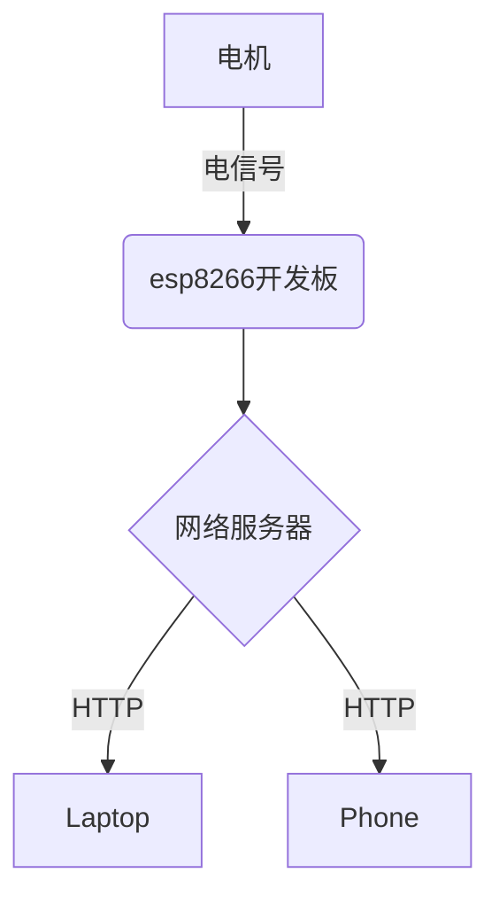

# 第2节 一个小白的诞生

使用esp8266开发板，组装并遥控一辆小车，通过网页端发送命令来遥控它

## 学习流程

### 课程引入（10分钟）

活动名称 | 活动内容 | 时间分配
:-: | :-: | :-:
活动目标| 通过ip地址遥控一辆小车 | 5分钟
背景知识 | HTTP服务 | 5分钟

### 基本任务（30分钟）

活动名称 | 活动内容 | 时间分配
:-: | :-: | :-:
硬件准备 | 将硬件按文档进行连接 | 5分钟
程序及操作 | 完成程序及操作文档部分 | 25分钟

### 活动小结（5分钟）

---

## 活动目标

- 了解HTTP通信概念
- 体验使用开发板控制电机
- 学会使用ip地址访问服务器

## 背景知识

### HTTP通信

HTTP，即超文本传输协议，是 HyperText Transfer Protocol的缩写。
通过WiFi，我们可以以无线的方式来传递需求。

### 电机

电机一般用作小车的动力系统。当电机接上正向电压时，电机会正转，当电机接上反向电压时，电机会反转。  
当电机接上的电压不同时，电机转动的速度也会有所不同。由于开发板能提供给小车的电压有限，所以我们  
通常不会直接将电机接在开发板上，而是会找一块电机驱动扩展板。

## 硬件准备

### 整体结构

### 硬件清单

- 小车套件(底盘和夹层，电机，车轮，万向轮，铜柱等)
- esp8266开发板
- 电机扩展板
- 杜邦线，数据线
- 移动电源

### 硬件连接

- 将两个车轮分别与电机相连

- 使用理线带，将电机和万向轮固定在底盘上

- 使用铜柱，增加一层夹层

- 将esp8266开发板和电机扩展板如图相连，将电机连接到图示位置。

- 使用数据线连接esp8266开发板和移动电源，将移动电源置于小车夹层并加以固定

### **程序及操作**

#### 操作步骤

1.打开`learn-ai`文件夹，打开路径`codes/chapter3/esp8266_projects/esp8266_WiFicar_https`  
2.将esp8266通过数据线连接到电脑  
3.使用Arduino IDE打开文件`esp8266_WiFicar_https.ino`  
4.记得把前面的[环境准备](#setup-2)部分再次确认，将环境正确配置，然后点击上传按钮进行上传  

5.点击`工具`菜单，选择`esp8266 Sketch Data Upload`,会自动将项目目录下的data文件夹上传到esp8266开发板上  
6.打开[路由器管理地址](http://192.168.123.1)，esp8266此时应该已经加入到了局域网中，查看esp8266获取到的路由器地址  
7.将esp8266与电脑连接断开，连接到移动电源上  
8.在浏览器中打开esp8266获取到的局域网地址，通过点击上下左右按钮或键盘的光标键来控制小车  

### **活动小结**

总结课程主要内容，强调重难点
