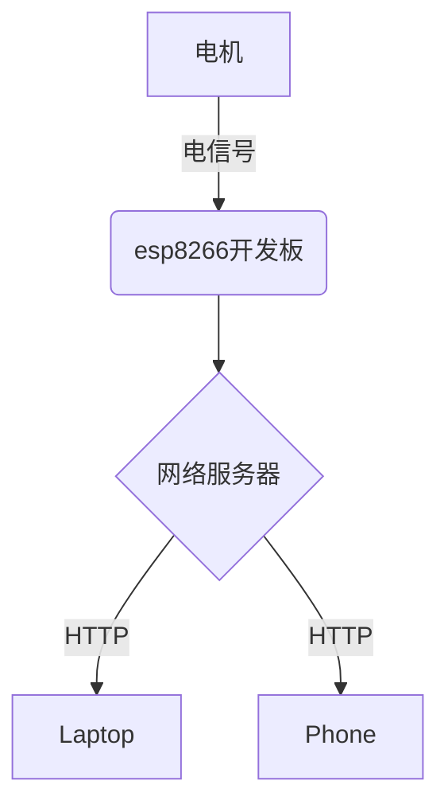

    
    通过迭代的方式不断赋予小车更多的功能

## 第1节 小白的心脏：esp8266开发板

    熟悉操作esp8266的步骤。是第一章的基础  
    包括功能提出和实现，硬件连接，上传的参数调节和html文件在本地服务器中的打开，传感器数据的实时呈现等，并使用Chart.js来绘制实时变化曲线  
    这部分主要包括两种传感器的读取，为温湿度传感器和超声波传感器
---

### **学习流程**

#### 课程引入（10分钟）

活动名称 | 活动内容 | 时间分配
:-: | :-: | :-:
活动目标| 了解物联网基本概念 | 5分钟
背景知识 | 熟悉实验中涉及到的软硬件 | 5分钟

#### 基本任务（30分钟）

活动名称 | 活动内容 | 时间分配
:-: | :-: | :-:
硬件准备 | 将硬件按文档进行连接 | 5分钟
程序及操作 | 完成程序及操作文档部分 | 25分钟

#### 活动小结（5分钟）

---

### **活动目标**

- 了解物联网的基本概念
- 了解使用开发板读取传感器的基本原理
- 熟悉使用Arduino IDE烧录固件的操作流程

### **背景知识**

#### 物联网背景知识

<iframe src="https://player.bilibili.com/player.html?aid=46814591&cid=82000363&page=1" width="800" height="600" scrolling="no" border="0" frameborder="no" framespacing="0" allowfullscreen="true"> </iframe>

#### 使用开发板读取传感器数据

esp8266是WiFi串口模块，功能简单来讲就是：从WiFi接收到数据，串口输出；从串口接收数据，WiFi输出数据。  

通过自带的GPIO口连接传感器，传感器将环境数据转化为电信号发送给esp8266读取、处理并输出。

### **硬件准备**

#### 硬件清单

- esp8266主板
插图
- 温湿度传感器（型号为DHT11或DHT22）
插图
- 超声波传感器（型号为HC-SR04）
插图
- 杜邦线、数据线
插图

#### 硬件连接

图解

### **程序及操作**

#### 简单读取

1.打开`learn-ai`文件夹，打开路径`codes/chapter2/esp8266_projects/esp8266_dht11_http`  
2.将esp8266通过数据线连接到电脑  
3.使用Arduino IDE打开文件`esp8266_dht11_https.ino`  
4.记得把前面的[环境准备](#setup-2)部分再次确认，将环境正确配置，然后点击上传按钮进行上传  

5.打开[路由器管理地址](http://192.168.0.1)，esp8266此时应该已经加入到了局域网中，查看esp8266获取到的路由器地址  
6.在浏览器中打开esp8266获取到的局域网地址，查看温湿度传感器的读数  
7.连接另一个esp8266开发板，打开路径`codes/chapter2/esp8266_projects/esp8266_ultrasonic_http`,再次执行2-6步骤来使用超声波传感器  

#### 绘制实时曲线

1.打开`learn-ai`文件夹，打开路径`codes/chapter2/esp8266_projects/esp8266_dht11_http_chartjs`  
2.将esp8266通过数据线连接到电脑  
3.使用Arduino IDE打开文件 `esp8266_dht11_http_chartjs.ino`  
4.记得把前面的[环境准备](#setup-2)部分再次确认，将环境正确配置，然后点击上传按钮进行上传  

5.打开[路由器管理地址](http://192.168.0.1)，esp8266此时应该已经加入到了局域网中，查看esp8266获取到的路由器地址  
6.在浏览器中打开esp8266获取到的局域网地址，查看温湿度传感器的读数  

### **活动小结**

总结课程主要内容，强调重难点

## 第2节 一个小白的诞生

使用esp8266开发板，组装并遥控一辆小车，通过网页端发送命令来遥控它

### **学习流程**

#### 课程引入（10分钟）

活动名称 | 活动内容 | 时间分配
:-: | :-: | :-:
活动目标| 通过ip地址遥控一辆小车 | 5分钟
背景知识 | HTTP服务 | 5分钟

#### 基本任务（30分钟）

活动名称 | 活动内容 | 时间分配
:-: | :-: | :-:
硬件准备 | 将硬件按文档进行连接 | 5分钟
程序及操作 | 完成程序及操作文档部分 | 25分钟

#### 活动小结（5分钟）

---

### **活动目标**

- 了解HTTP通信概念
- 体验使用开发板控制电机
- 学会使用ip地址访问服务器

### **背景知识**

#### HTTP通信

HTTP，即超文本传输协议，是 HyperText Transfer Protocol的缩写。
通过WiFi，我们可以以无线的方式来传递需求。

#### **电机**

电机一般用作小车的动力系统。当电机接上正向电压时，电机会正转，当电机接上反向电压时，电机会反转。  
当电机接上的电压不同时，电机转动的速度也会有所不同。由于开发板能提供给小车的电压有限，所以我们  
通常不会直接将电机接在开发板上，而是会找一块电机驱动扩展板。

### **硬件准备**

#### 整体结构

#### 硬件清单

- 小车套件(底盘和夹层，电机，车轮，万向轮，铜柱等)
- esp8266开发板
- 电机扩展板
- 杜邦线，数据线  
- 移动电源

#### 硬件连接

- 将两个车轮分别与电机相连

- 使用理线带，将电机和万向轮固定在底盘上

- 使用铜柱，增加一层夹层

- 将esp8266开发板和电机扩展板如图相连，将电机连接到图示位置。

- 使用数据线连接esp8266开发板和移动电源，将移动电源置于小车夹层并加以固定

### **程序及操作**

#### 操作步骤

1.打开`learn-ai`文件夹，打开路径`codes/chapter3/esp8266_projects/esp8266_WiFicar_https`  
2.将esp8266通过数据线连接到电脑  
3.使用Arduino IDE打开文件`esp8266_WiFicar_https.ino`  
4.记得把前面的[环境准备](#setup-2)部分再次确认，将环境正确配置，然后点击上传按钮进行上传  

5.点击`工具`菜单，选择`esp8266 Sketch Data Upload`,会自动将项目目录下的data文件夹上传到esp8266开发板上  
6.打开[路由器管理地址](http://192.168.123.1)，esp8266此时应该已经加入到了局域网中，查看esp8266获取到的路由器地址  
7.将esp8266与电脑连接断开，连接到移动电源上  
8.在浏览器中打开esp8266获取到的局域网地址，通过点击上下左右按钮或键盘的光标键来控制小车  

### **活动小结**

总结课程主要内容，强调重难点

---

## 第3节 是汽车也是汽车人：小白机械臂

    使用esp8266，通过网页端发送命令，控制多个舵机

### **学习流程**

#### 课程引入（15分钟）

活动名称 | 活动内容 | 时间分配
:-: | :-: | :-:
活动目标| 通过WiFi超控机械臂 | 5分钟
背景知识 | 舵机的工作原理及脉冲宽度调制 | 10分钟

#### 基本任务（35分钟）

活动名称 | 活动内容 | 时间分配
:-: | :-: | :-:
硬件准备 | 将硬件按文档进行连接 | 5分钟
程序及操作 | 完成程序及操作文档部分 | 25分钟

#### 活动小结（10分钟）

### **活动目标**

- 了解舵机的原理和使用方法
- 了解脉冲宽度调制（PWM）
- 通过WiFi遥控机械臂

### **背景知识**

#### 舵机

伺服电机通常被称为舵机，它是一种带有输出轴的小装置。当我们向伺服器发送一个控制信号时，输出轴就可以转到特定的位置。只要控制信号持续不变，伺服机构就会保持轴的角度位置不改变。如果控制信号发生变化，输出轴的位置也会相应发生变化。日常生活中，舵机常被用于遥控飞机、遥控汽车、机器人等。  

#### 舵机的工作原理

舵机内部的控制电路、电位计（可变电阻器）和电机均被连接到电路板上。控制电路通过电位计可监控舵机的当前角度。  

其工作流程为：控制信号 → 控制电路板 → 电机转动 → 齿轮组减速 → 舵盘转动 → 位置反馈电位计 → 控制电路板反馈。

#### 脉冲宽度调制（PWM）

脉冲宽度调制，英文名Pulse Width Modulation，缩写为PWM，它是通过对一系列脉冲的宽度进行调制，等效出所需要的波形，对模拟信号电平进行数字编码。  

#### 占空比

占空比是指在一个周期内，信号处于高电平的时间占据整个信号周期的百分比。

上图信号一个周期的时间为4ms，其中高电平时间为1ms。占空比为：$$ \frac {高电平时间} {一个周期} = \frac {1ms} {4ms} = 25\% $$

### **硬件准备**

#### 硬件清单

- esp8266主板
- 电机扩展板 esp12E Motor Shield
- 舵机
- 杜邦线、数据线
- 机械臂和零件

#### 硬件连接

此处表示舵机连接到了D0口，最多可以连9个舵机（D0-D9） 
黄色-信号D（DATA） 
红色-正极V（VCC） 
棕色-负极G（GND） 

### **程序及操作**

#### 操作步骤

1. 打开`learn-ai`文件夹，打开路径`codes/chapter2/esp8266_projects/esp8266_servoarm_http`  
2. 将esp8266通过数据线连接到电脑
3. 使用Arduino IDE打开文件`esp8266_servoarm_http.ino`  
4. 记得把前面的[环境准备](#setup-2)部分再次确认，将环境正确配置，然后点击上传按钮进行上传
   

   

5. 点击`工具`菜单，选择`esp8266 Sketch Data Upload`,会自动将项目目录下的data文件夹上传到esp8266开发板上  
6. 打开[路由器管理地址](http://192.168.0.1)，esp8266此时应该已经加入到了局域网中，查看esp8266获取到的路由器地址  
7. 将esp8266与电脑连接断开，连接到移动电源上
8. 在浏览器中打开esp8266获取到的局域网地址，通过拖动滑块来控制机械臂

### **活动小结**

总结课程主要内容，强调重难点

---

## 第4节 视物而行：为小白增加视觉系统

    esp32是esp8266的升级版本。拥有更强的处理能力，能够很好的处理实时视频和音频等数据。通过本部分来为小车增加实时视频的功能。  
    也许，你会希望在小车上装一个摄像头，这样就可以身临其境的遥控它了。

---

### **学习流程**

#### 课程引入（10分钟）

活动名称 | 活动内容 | 时间分配
:-: | :-: | :-:
活动目标| 实时网络摄像头搭建及人脸识别 | 5分钟
背景知识 | esp32的相关知识与操作 | 5分钟

#### 基本任务（30分钟）

活动名称 | 活动内容 | 时间分配
:-: | :-: | :-:
硬件准备 | 将硬件按文档进行连接 | 5分钟
程序及操作 | 完成程序及操作文档部分 | 25分钟

#### 活动小结（5分钟）

---

### **活动目标**

- 确定活动方向并提出需要解决的问题
- 了解esp32的功能及引脚并熟练了解实验步骤
- 按照操作步骤实际操作并完成小车实时摄像等相关功能
- 对实验进行总结，并分析遇到的问题

### **背景知识**

esp32是一系列低成本，低功耗的片上 微控制器系统，集成了Wi-Fi和双模蓝牙。esp32包括双核和单核变体，包括内置天线开关，功率放大器，低噪声接收放大器，滤波器和电源管理模块。  

### **硬件准备**

#### 硬件清单

- esp32主板
- ov2640摄像头
- USB转TTL编程器
- 杜邦线

#### 硬件连接

**注意：`IO0`口需要和它边上的`GND`口用一根杜邦线连接到一起，这样才可以正常上传代码**

### **程序及操作**

#### 操作步骤

1.打开`learn-ai`文件夹，打开路径`codes/chapter2/esp32_projects/esp32_webcam`  
2.将上图连接好后，将USB转TTL编程器插入电脑  
3.使用Arduino IDE打开文件`esp32_webcam.ino`  
4.配置esp32的上传环境如下图所示：  

5.上传完毕后，保持USB连接在电脑上。将`IO0`口需要和它边上的`GND`口杜邦线拔掉，按一下esp32主板上面的`reset`键  
6.打开[路由器管理地址](http://192.168.123.1)，esp32此时应该已经加入到了局域网中，查看esp32获取到的路由器地址  
7.在浏览器中打开esp32获取到的局域网地址，在左侧最下方选择`Start Stream`  

### **活动小结**

总结课程主要内容，强调重难点

## 第5节 听声辨位：小白会自动避障了

    使用esp8266，加上超声传感器，设计一辆自动避障小车

### **学习流程**

#### 课程引入（10分钟）

活动名称 | 活动内容 | 时间分配
:-: | :-: | :-:
活动目标| 设计一辆能够自动躲避障碍物的小车 | 5分钟
背景知识 | 超声测距的原理 | 5分钟

#### 基本任务（30分钟）

活动名称 | 活动内容 | 时间分配
:-: | :-: | :-:
硬件准备 | 将硬件按文档进行连接 | 5分钟
程序及操作 | 完成程序及操作文档部分 | 25分钟

#### 活动小结（5分钟）

---

### **活动目标**

- 学会控制esp8266的GPIO
- 学会使用电机驱动扩展模块（ESP12E）
- 学会使用esp8266的服务器

### **背景知识**

#### **超声传感器**

超声波传感器是一个输入模块，提供了非常好的非接触范围检测，性能稳定，易于使用，盲区小，准确度高，测距距离从2厘米到400厘米不等，关键是还很便宜，在创客圈应用最为广泛，包括：机器人测距避障，液位检测等。  
一般来说，超声传感器有四个引脚:  
1.GND引脚，接地  
2.VCC引脚，接电源  
3.TRIG引脚，控制端，接开发板的输出端口  
4.ECHO引脚，接收端，接开发板的输入端口  

#### **超声波测距原理**

 超声波传感器的发射器向某一方向发射超声波，在发射的同时开始计时，超声波在空气中传播，途中碰到障碍物就立即返回来，  
 超声波接收器收到反射波就立即停止计时。根据计时器记录的时间t，声波在空气中的传播速度为340m/s，就可以计算出发射点  
 距障碍物的距离s，即：s=340m/s× t / 2 。这就是所谓的时间差测距法。  

### **硬件准备**

#### 硬件清单

- esp8266主板
- 电机扩展板 esp12E Motor Shield  
- 两个超声传感器  
- 两个舵机  
- 一个蜂鸣器
- 小车套件(3D打印的底盘和夹层，电机，车轮，铜柱等)
- 杜邦线，数据线  
- 电源（电池或者充电宝）

#### 硬件连接

### **程序及操作**

#### 操作步骤

1.打开`learn-ai`文件夹，打开路径`codes/chapter2/esp8266_projects/esp8266_Auto_avoid_car`  
2.将esp8266通过数据线连接到电脑  
3.使用Arduino IDE打开文件`esp8266_WiFicar_https.ino`  
4.记得把前面的[环境准备](#setup-2)部分再次确认，将环境正确配置，然后点击上传按钮进行上传  

5.点击`工具`菜单，选择`esp8266 Sketch Data Upload`,会自动将项目目录下的data文件夹上传到esp8266开发板上  
6.打开[路由器管理地址](http://192.168.0.1)，esp8266此时应该已经加入到了局域网中，查看esp8266获取到的路由器地址  
7.将esp8266与电脑连接断开，连接到移动电源上  
8.在浏览器中打开esp8266获取到的局域网地址，通过点击上下左右按钮或键盘的光标键来控制小车  

### **活动小结**

总结课程主要内容，强调重难点

---

## 第6节 综合与进阶

    试着把前面的功能整合到一个小车上，并在一个界面上对它们进行读取和控制。

### **趣味比赛**

    每小组为一个队伍，按照规则比赛抓取物品

#### 比赛规则

- sector 1
- sector 2
- sector 3

### **功能参考**

- 代码在`learn-ai/chapter3/part1.5`  
- 代码将第二、三、四节的功能结合到了一段程序中  
- 硬件部分将第二、三、四节连接到同一扩展板上  
- 第四节部分只需将esp32上的`3.3V`和`GND`用杜邦线连接到esp8266扩展板舵机连接处的对应接口,使用扩展板为esp32进行供电。如下图：

红色-正极V 
棕色-负极G 

---

## 第7节 尾声

  通过前面的例子，你已经可以使用无线网络的方式来让esp8266读取传感器数据，控制简单的电机，查看网络摄像头等。其实这些已经是物联网的雏形。
  在后面的章节里，结合强大的人工智能，你的小车会愈发强大。  

- 通过语音技术，让小车听懂你的指令
- 通过计算机视觉，让机械臂自动识别和抓取特定物体
- 通过深度学习，让小车自动追踪特定物体，以及无人驾驶
